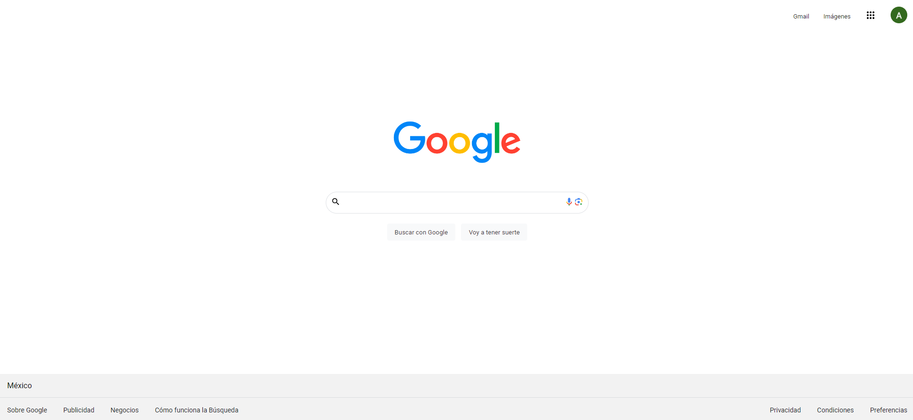

# Mi clon de Google

El presente proyecto es un portafolio desarrollado para poner en práctica las habilidades obtenidas dentro del bootcamp de desarrollo fronted de Technolochicas PRO.

Fue desarrollado con HTML y CSS.

La página es responsiva (adaptable a diferentes tamaños de pantalla).

## Secciones de mi sitio

## Tecnologías

* HTML
* CSS

---
 
Desarrollado con 💜 por Sofía en [TECHNOLOCHICAS PRO](https://tecnolochicas.mx/) 